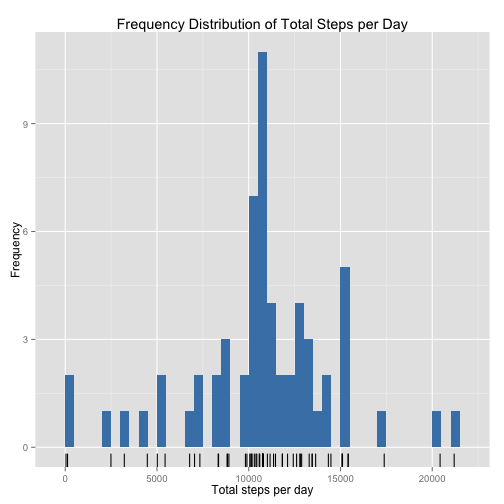

# Reproducible Research: Peer Assessment 1

## Abstract

(Quotation from the assignment)

> It is now possible to collect a large amount of data about personal movement using activity monitoring devices such as a Fitbit, Nike Fuelband, or Jawbone Up. These type of devices are part of the "quantified self" movement -- a group of enthusiasts who take measurements about themselves regularly to improve their health, to find patterns in their behavior, or because they are tech geeks. But these data remain under-utilized both because the raw data are hard to obtain and there is a lack of statistical methods and software for processing and interpreting the data.

> This assignment makes use of data from a personal activity monitoring device. This device collects data at 5 minute intervals through out the day. The data consists of two months of data from an anonymous individual collected during the months of October and November, 2012 and include the number of steps taken in 5 minute intervals each day.

## Initialise

The required libraries are first loaded.


```r
library("data.table")  # improved dataframe
library("ggplot2")  # data viz
library("lubridate")  # simplifies date manipulation
```

```
## 
## Attaching package: 'lubridate'
## 
## The following objects are masked from 'package:data.table':
## 
##     hour, mday, month, quarter, wday, week, yday, year
```


## Loading and preprocessing the data

The data is first loaded directly from the `.zip` file without unzipping (using the `unz()` function). Missing variables are coded appropriately as `NA` and the `lubridate` function `ymd()` is used to convert the dates to the appropriate type.


```r
DF <- read.csv(unz("activity.zip", "activity.csv"), na.strings = "NA")
DF$date <- ymd(DF$date)
DT <- data.table(DF)
setkey(DT, interval)  # to make a later merge easier
```


The structure of the dataframe is verified:


```r
str(DT)
```

```
## Classes 'data.table' and 'data.frame':	17568 obs. of  3 variables:
##  $ steps   : int  NA 0 0 47 0 0 0 NA 0 34 ...
##  $ date    : POSIXct, format: "2012-10-01" "2012-10-02" ...
##  $ interval: int  0 0 0 0 0 0 0 0 0 0 ...
##  - attr(*, ".internal.selfref")=<externalptr> 
##  - attr(*, "sorted")= chr "interval"
```


We have 17568 observations of three variables, as specified in the assignment. The three variables are of the right class and represent the following (quoting again from the assignment):

> - **steps**: Number of steps taken in a 5-minute interval (missing values are coded as NA)
> - **date**: The date on which the measurement was taken in YYYY-MM-DD format
> - **interval**: Identifier for the 5-minute interval in which measurement was taken

## What is mean total number of steps taken per day?

A new datatable is created with two columns:

- **date**: The date on which the measurement was taken in POSIXct format
- **total_steps**: the total number of steps recorded for the day, ignoring missing values.


```r
DT_total_steps <- DT[, sum(steps, na.rm = TRUE), by = date]
setnames(DT_total_steps, c("date", "total_steps"))
head(DT_total_steps)  # quick peek at top rows to check all is well
```

```
##          date total_steps
## 1: 2012-10-01           0
## 2: 2012-10-02         126
## 3: 2012-10-03       11352
## 4: 2012-10-04       12116
## 5: 2012-10-05       13294
## 6: 2012-10-06       15420
```


### Calculating Mean and Median Number of steps


```r
summary(DT_total_steps[, total_steps])
```

```
##    Min. 1st Qu.  Median    Mean 3rd Qu.    Max. 
##       0    6780   10400    9350   12800   21200
```


- **Mean**: 9354 steps per day
- **Median**: 10400 steps per day

### Visualizing Total steps


```r
p <- ggplot(DT_total_steps, aes(total_steps))
p <- p + geom_bar(fill = "steelblue", binwidth = 500)
p <- p + geom_rug()
p <- p + xlab("Total steps per day") + ylab("Frequency")
p <- p + ggtitle("Frequency Distribution of Total Steps per Day")
p
```

 


For added visual cue on the distribution of the individual values, a `geom_rug()` is added on the x-axis. 

Given the ["magic target of 10,000 steps"](http://blog.fitbit.com/the-magic-of-10000-steps/) well-known to many users of Fitbit and similar devices, it is interesting to note that 10,000 total steps is a peak in the distribution, followed by 15,000 -- implying that the user is making an effort to reach or just exceed these targets.

## What is the average daily activity pattern?

A new datatable is created with two columns:

- **interval**: Identifier for the 5-minute interval in which measurement was taken
- **average_steps**: the average number of steps recorded for the interval, ignoring missing values.


```r
DT_mean_steps <- DT[, mean(steps, na.rm = TRUE), by = interval]
setnames(DT_mean_steps, c("interval", "mean_steps"))
head(DT_mean_steps)  # quick peek at top rows to check all is well
```

```
##    interval mean_steps
## 1:        0    1.71698
## 2:        5    0.33962
## 3:       10    0.13208
## 4:       15    0.15094
## 5:       20    0.07547
## 6:       25    2.09434
```


```r
p <- ggplot(DT_mean_steps, aes(x = interval, y = mean_steps))
p <- p + geom_line(colour = "steelblue")
p <- p + xlab("Interval") + ylab("Mean Steps")
p <- p + ggtitle("Activity per 5-minute Interval")
p <- p + annotate("text", x = 1400, y = 206, label = "206.170 steps at interval 835", 
    colour = "red")
p <- p + annotate("point", x = 835, y = 206.1698, colour = "red")
p
```

 


The peak activity is annotated on the graph. The point of maximal activity is calculated below.

### Point of Maximum Activity

The 5-minute interval, on average across all the days in the dataset, containing the maximum number of steps is identified:


```r
DT_mean_steps[mean_steps == max(mean_steps)]
```

```
##    interval mean_steps
## 1:      835      206.2
```

```r
setkey(DT_mean_steps, interval)  # to make a later merge easier
```


The highest average number of steps is 206.170 recorded in the **5-minute interval with id 835**.

## Imputing missing values

> **Step 1**: Calculate and report the total number of missing values in the dataset (i.e. the total number of rows with NAs)


```r
sum(is.na(DT))
```

```
## [1] 2304
```


**There are 2304 rows with missing data.**

> **Step 2**: Devise a strategy for filling in all of the missing v?data.table
alues in the dataset. The strategy does not need to be sophisticated. For example, you could use the mean/median for that day, or the mean for that 5-minute interval, etc.

The strategy to be adopted is to replace missing values of steps with the mean activity for that 5-minute interval using these steps:

1. Merge the original data.table (DT) with the mean scores data.table (DT_mean_steps) since they are both keyed by `interval`
2. Set the steps column to numeric type
3. Replace any missing values for steps by the mean_steps value on the same row

> **Step 3**: Create a new dataset that is equal to the original dataset but with the missing data filled in.


```r
mDT <- DT[DT_mean_steps]  # join two data tables keyed by interval
mDT$steps <- as.numeric(mDT$steps)  # convert steps to correct type
# replace missing steps with corresponding mean value
mDT$steps[is.na(mDT$steps)] <- mDT[is.na(mDT$steps), mean_steps]
```


> **Step 4**: Make a histogram of the total number of steps taken each day and Calculate and report the mean and median total number of steps taken per day. Do these values differ from the estimates from the first part of the assignment? What is the impact of imputing missing data on the estimates of the total daily number of steps?


```r
mDT_total_steps <- mDT[, sum(steps), by = date]
setnames(mDT_total_steps, c("date", "total_steps"))
head(mDT_total_steps)  # quick peek at top rows to check all is well
```

```
##          date total_steps
## 1: 2012-10-01       10766
## 2: 2012-10-02         126
## 3: 2012-10-03       11352
## 4: 2012-10-04       12116
## 5: 2012-10-05       13294
## 6: 2012-10-06       15420
```


```r
summary(mDT_total_steps[, total_steps])
```

```
##    Min. 1st Qu.  Median    Mean 3rd Qu.    Max. 
##      41    9820   10800   10800   12800   21200
```


- **Updated Mean**: 10770 steps per day
- **Updated Median**: 10770 steps per day


```r
p <- ggplot(mDT_total_steps, aes(total_steps))
p <- p + geom_bar(fill = "steelblue", binwidth = 500)
p <- p + geom_rug()
p <- p + xlab("Total steps per day") + ylab("Frequency")
p <- p + ggtitle("Frequency Distribution of Total Steps per Day")
p
```

 


### Effect of Imputing Missing Values

The effect of imputing a value for all missing observations of steps has shifted the distribution to the right, increasing the estimates of both mean and median. The distribution has also become more symmetrical and the mean and median are now coincident.

## Are there differences in activity patterns between weekdays and weekends?


```r
mDT[, `:=`(weekday, (wday(date) > 1 & wday(date) < 7))]
```

```
##        interval  steps       date mean_steps weekday
##     1:        0  1.717 2012-10-01      1.717    TRUE
##     2:        0  0.000 2012-10-02      1.717    TRUE
##     3:        0  0.000 2012-10-03      1.717    TRUE
##     4:        0 47.000 2012-10-04      1.717    TRUE
##     5:        0  0.000 2012-10-05      1.717    TRUE
##    ---                                              
## 17564:     2355  0.000 2012-11-26      1.075    TRUE
## 17565:     2355  0.000 2012-11-27      1.075    TRUE
## 17566:     2355  0.000 2012-11-28      1.075    TRUE
## 17567:     2355  0.000 2012-11-29      1.075    TRUE
## 17568:     2355  1.075 2012-11-30      1.075    TRUE
```

```r
mDT$weekday[mDT$weekday == TRUE] <- "weekday"
mDT$weekday[mDT$weekday == FALSE] <- "weekend"
mDT$weekday <- as.factor(mDT$weekday)
str(mDT)
```

```
## Classes 'data.table' and 'data.frame':	17568 obs. of  5 variables:
##  $ interval  : int  0 0 0 0 0 0 0 0 0 0 ...
##  $ steps     : num  1.72 0 0 47 0 ...
##  $ date      : POSIXct, format: "2012-10-01" "2012-10-02" ...
##  $ mean_steps: num  1.72 1.72 1.72 1.72 1.72 ...
##  $ weekday   : Factor w/ 2 levels "weekday","weekend": 1 1 1 1 1 2 2 1 1 1 ...
##  - attr(*, "sorted")= chr "interval"
##  - attr(*, ".internal.selfref")=<externalptr>
```


```r
mDT_mean_steps <- mDT[, mean(steps), by = c("weekday", "interval")]
setnames(mDT_mean_steps, c("weekday", "interval", "steps"))
```


```r
p <- ggplot(mDT_mean_steps, aes(x = interval, y = steps), )
p <- p + geom_line() + facet_grid(weekday ~ .)
p <- p + xlab("Interval") + ylab("Number of steps")
p
```

 


